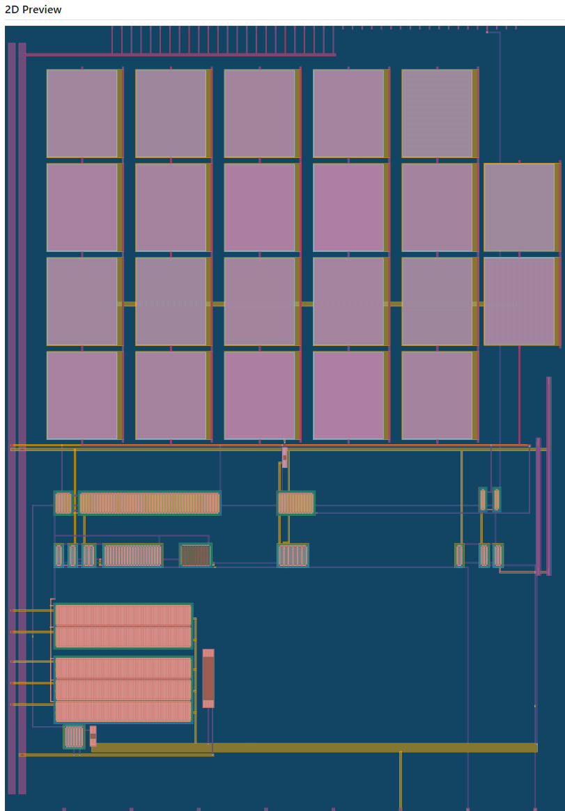
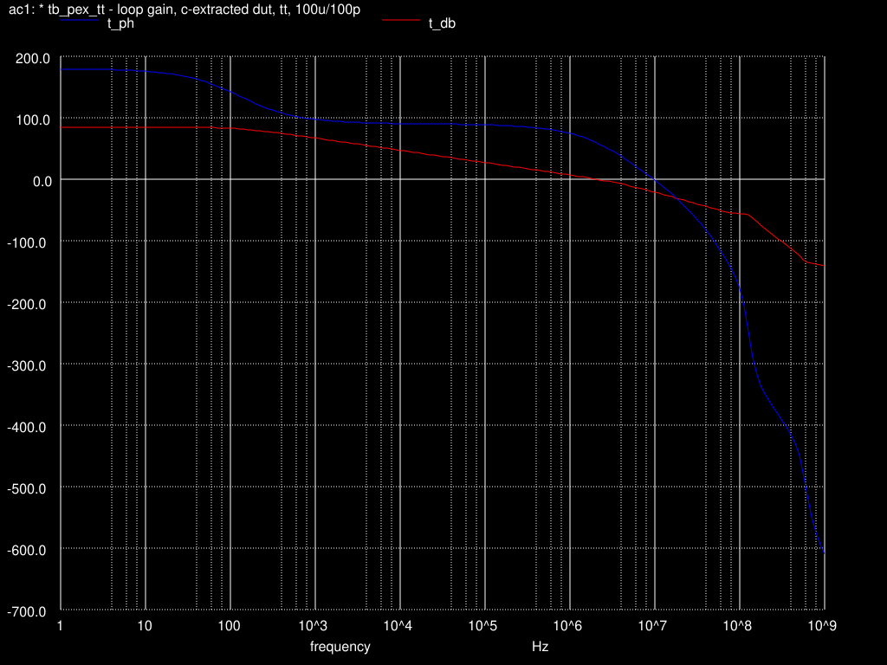
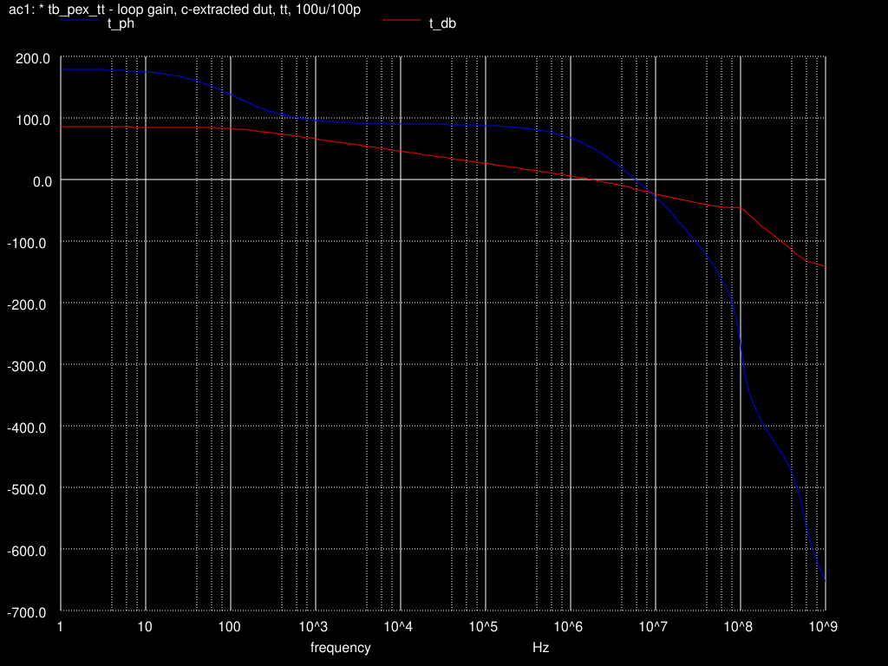
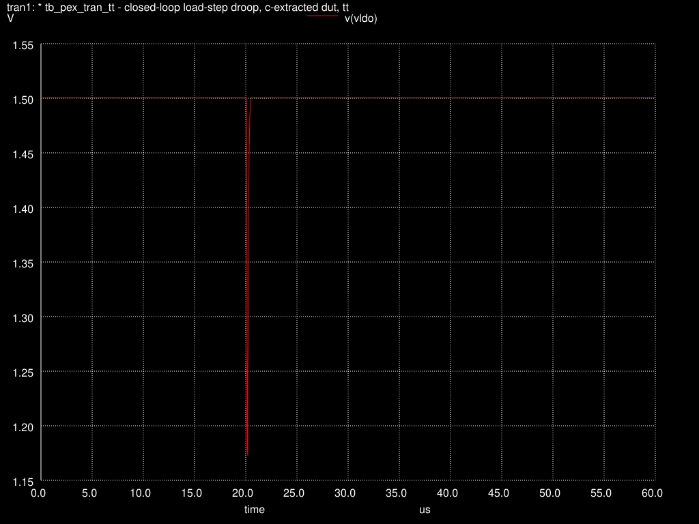

# tt-ota-sky130 — TinyLDO

A fully analog **1.5 V low-dropout regulator** on SKY130, designed for Tiny Tapeout **TTSKY26c**. Two-stage Miller OTA → super-source-follower buffer → 2 mm-wide segmented PMOS pass device, with on-chip bias generation, feedback divider, RC compensation, and a built-in switched-load demo. **16 transistors, 6 passives, zero digital gates.**


*Full tile (161 × 225.76 µm). Top: 22-unit MiM compensation array. Middle: OTA, buffer and bias blocks. Bottom-left: the segmented pass device and switched-load demo. Explore it in the [interactive viewer](https://ogggggish.github.io/tt-ota-sky130/).*

## Key specifications

All "post-layout" numbers are from the C-extracted netlist (magic PEX, ngspice-46, sky130A models).

| Parameter | Value | Conditions |
|---|---|---|
| Technology / tile | SKY130A, TT 1×2 analog tile | 3 analog pins used |
| Input supply | 1.8 V (VDPWR) | |
| Output voltage | **1.5 V** (measured 1.5008 V) | light and heavy load |
| External reference | 0.9 V into `ua[0]` | high-impedance input |
| External bias | 10 µA into `ua[1]` | single current, mirrored on-chip |
| Design load | 1.1 mA continuous | + ~2.8 mA switched-load demo |
| Dropout | 14.8 mV @ 1.1 mA | schematic |
| DC loop gain | 84.8 dB | post-layout, tt |
| Unity-gain frequency | 2.04 MHz | post-layout, tt |
| Phase margin | **59.6° / 51.8° / 70.7°** | tt 27 °C / ss 125 °C / ff −40 °C, post-layout |
| Stability floor | ≥ 45° all corners | worst-case margin 6.8° |
| Load-step droop | **−328 mV**, full recovery | 0.1 → ~2.8 mA, C_L = 100 pF |
| Recovery behaviour | bottoms out ~180 ns after the step | returns to 1.5008 V |
| Compensation | 22 × `cap_mim_m3_1` + zero-cancelling RZ | Miller, across 2nd stage |
| Pass device | 2000 µm / 0.15 µm PMOS, two guard-ringed segments | 1200 + 800 µm in parallel |

**Verification status:** LVS clean (netgen: *Circuits match uniquely*) · **Tiny Tapeout precheck 15/15 green** · full-corner post-layout AC · post-layout load-step transient.

## Measured plots

**Loop gain and phase — post-layout, tt corner** (crossover ≈ 2 MHz, PM = 59.6°):



**Worst corner — ss, 125 °C** (PM = 51.8°, still clear of the 45° floor):



**Load-step transient, 0.1 → ~2.8 mA** (droop −328 mV, full recovery to 1.5008 V):



## Pinout

| Pin | Direction | Function |
|---|---|---|
| `ua[0]` | in | Reference, 0.9 V |
| `ua[1]` | in | Bias, 10 µA (≈110 kΩ from 1.8 V works) |
| `ua[2]` | out | Regulated 1.5 V output / sense (attach C_L ≈ 100 pF) |
| `ui_in[0]` | in | Switched-load enable (~2.8 mA on-chip demo load) |

`ua[3..7]` unconnected by design; all digital outputs are tied to ground internally.

## Architecture

A two-stage Miller-compensated OTA (NMOS input pair, PMOS mirror load, common-source second stage) drives a super-source-follower buffer (`pfet_01v8_lvt` in its own n-well), which drives the segmented PMOS pass device. An on-chip 0.35 µm high-res poly divider (exact 2:3) closes the loop against the external 0.9 V reference; a single 10 µA external current is mirrored into every internal branch. Full architecture, bring-up guide and measured plots: [`docs/info.md`](docs/info.md).

## Design notes

The pass FET is split into two segments (M=3 + M=2 rows of 80 fingers), each with its own full guard ring, per Tiny Tapeout guidance — this keeps all P-diffusion within 15 µm of a well tap (SKY130 latch-up rule LU.3). The schematic keeps a single 2000 µm device; netgen's parallel-device merging matches the two layout segments against it, so the entire verification history (LVS, full-corner AC, droop transient) remains valid with zero schematic changes.

Magic's generated `res_*high_po_0p35` resistor cells emit rpm/urpm implant masks below the 1.27 µm minimum width (a known issue with the narrow 0p35 cells). `scripts/fix_res_masks.py` widens those masks inside the three resistor device cells after every `gds write` — run it as a fixed post-export step:

```
magic> gds write tt_um_ogggggish_ota_ldo.gds
$ klayout -b -r scripts/fix_res_masks.py
```

## Reproducing the simulations

Post-layout decks live in `sim/`. Two ngspice options are load-bearing for the extracted netlist:

- `.option rshunt=1e12` — the unused TT template pin stubs carry parasitic capacitance with no DC path; the shunt removes the singular matrix.
- `noopiter` (ss / 125 °C) — skips the first Newton attempt and starts directly with dynamic gmin stepping, avoiding a false-convergence plateau specific to the hot/slow corner.

Loop gain is measured by breaking the loop at the top of Rf1 and injecting through a 1 GH / 1 GF pair, reproducing the pre-layout methodology exactly (the schematic reference bench recovers the frozen baseline to 0.01°).

## Repo map

- `src/schematics/` — xschem schematics + SPICE netlist (`ldo_chip`)
- `src/layout/` — magic layout (`tt_um_ogggggish_ota_ldo` + subcells)
- `gds/`, `lef/` — submission artifacts (top-cell name = file name)
- `lvs/` — LVS wrapper, netlists, netgen report
- `sim/` — post-layout benches, C-extracted DUT wraps, corner logs, Bode/transient plots
- `scripts/fix_res_masks.py` — KLayout post-export mask fix
- `docs/` — `info.md` (architecture & bring-up), `layout_2d.png` (preview)

## Acknowledgments

Thanks to the Tiny Tapeout team — in particular for the "split the FET" guidance on the LU.3 question — and to the maintainers of magic, xschem, ngspice, netgen, KLayout, and IIC-OSIC-TOOLS.
